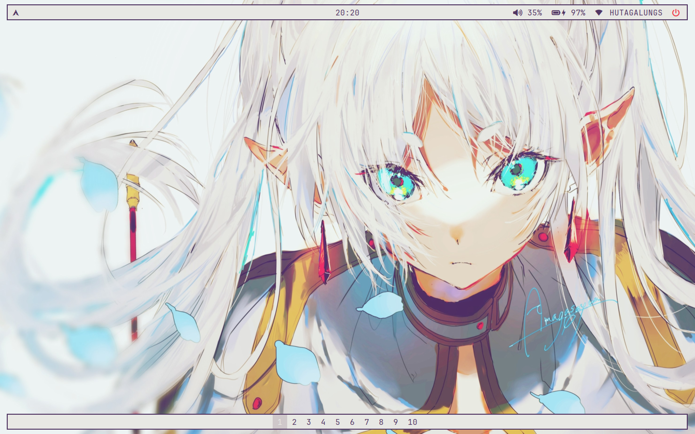

  
  

   <h1>Josterand's bspwm Rice</h1> 
  This rice features a minimalist design inspired by the calm, sincere, and kind nature of Frieren from the manga “Sousou no Frieren”. The rice incorporates a dual-bar layout—top and bottom bars—but maintains a clean and focused workspace, allowing users to fully concentrate on what they are doing.

  As long as I'm still using this rice, it will be in the process of development, with plans to continue updating colors, refining details, and possibly new functionality, keeping it fresh and clean.

## Screenshot

## System
- Operating System: [EndeavourOS Neo](https://endeavouros.com/) (it's an Arch-based distro, btw)
- Window Manager: [bspwm](https://github.com/baskerville/bspwm)
- Keybind Daemon: [sxhkd](https://github.com/baskerville/sxhkd)
- Shell: [Bash](https://www.gnu.org/software/bash/)
- Terminal: [Alacritty](https://github.com/alacritty/alacritty)
- Bar: [Polybar](https://github.com/polybar/polybar)
- Launcher: [Rofi](https://github.com/davatorium/rofi)
- Notification Daemon: [Dunst](https://github.com/dunst-project/dunst)

## Install
The structure of this repo is designed so that it can be easily installed using [GNU Stow](https://www.gnu.org/software/stow/). It's as simple as installing [GNU Stow](https://www.gnu.org/software/stow/), then `git clone` this repo in the top home directory (in your $HOME directory iykwim), `cd` in, and stow the configuration with the `stow .` command. 

I'm assuming you're already pretty good at using basic linux commands like `cd` and `git clone` so I won't teach you (too tired to write an installation guide, LOL).

## Fonts & Wallpapers
- Fonts: **JetBrainsMonoNerd Font**. Get it from [**here**](https://github.com/ryanoasis/nerd-fonts/releases/download/v3.2.1/JetBrainsMono.zip)
- Wallpaper: Thanks to [**アマガサ夕**](https://www.pixiv.net/en/users/103396341)'s beautiful [**artwork**](https://www.pixiv.net/en/artworks/116085885) on Pixiv!